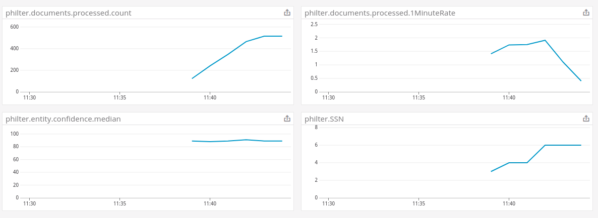

# Monitoring and Logging

## Service Management

Philter installs itself as a system service. The service can be controlled using the commands:

```
sudo systemctl stop philter
sudo systemctl start philter
sudo systemctl restart philter
sudo systemctl status philter
```

Philter is installed in the `/opt/philter` directory. This directory contains the Philter binaries, configuration files, and supporting files.

## Metrics

Philter collects metrics while running to provide insights into its operation and the text being processed. The metrics collected include a count of the documents processed by Philter, counts of the types of sensitive information identified per type, and the entity confidence values of entities extracted by non-deterministic natural language processing methods. These metrics can be reported via JMX, and to external services Prometheus, Amazon CloudWatch, and Datadog).

### Reporting Metrics to Prometheus

To enable Philter metric reporting to Prometheus modify Philter's [Settings](settings.md) to enable the Prometheus metrics. When enabled, the metrics HTTP endpoint will be `http://philter-ip:9100/metrics`.

Enable scraping of Philter's metrics in Prometheus' settings:

```
global:
  scrape_interval: 10s

scrape_configs:
- job_name: philter
  static_configs:
  - targets: ['10.0.2.104:9100']
```

You may need to make port `9100` accessible to Prometheus. For example, if you launch Philter in AWS you will need to modify Philter's security group to permit inbound network traffic on port `9100` to Prometheus.

### Reporting Metrics to Amazon CloudWatch

To enable Philter metric reporting to Amazon CloudWatch modify Philter's [Settings](settings.md) to set the AWS properties. Metrics will be published to CloudWatch every 60 seconds, by default, when enabled.

The AWS IAM user or role being used should have `PutMetricData` permissions:

```
{
    "Version": "2012-10-17",
    "Statement": [
        {
            "Sid": "VisualEditor0",
            "Effect": "Allow",
            "Action": [
                "cloudwatch:PutMetricData"
            ],
            "Resource": "*"
        }
    ]
}
```

The metrics will be published to the Amazon CloudWatch namespace provided in Philter's settings. Amazon CloudWatch can then be used to visualize the metrics, set performance alarms, or perform other integrations with AWS services.


### Reporting Metrics to Datadog

Metrics will be published to Datadog every 60 seconds when enabled.

Metrics published to Datadog will have a `philter` prefix.


The metrics can be used to make graphs and dashboards.



### Reporting Metrics to JMX

Metrics in JMX can be viewed using [visualvm](https://visualvm.github.io/) or similar tool.

### Metrics Collected and Reported

The listing below shows an example of the metrics Philter collects and writes to standard out while running. The metrics reported to supported services such as JMX, Amazon CloudWatch and Datadog will contain the same metrics but may be represented or visualized differently between the services.

The metrics collected include:

* A cumulative count of each type of sensitive information across all contexts and documents.
* The total count of documents processed.

These metrics will be reset when Philter is stopped and restarted.

## Logging

Philter's log file can be viewed using the command `journalctl -u philter`. This log should be the first place checked for more information on Philter's status.

The log level can be set using the `logging.level.root` property in Philter's [Settings](settings.md).

> Philter's log file may contain sensitive information. It is possible that through the normal use of Philter, sensitive information may be written to the log file.

