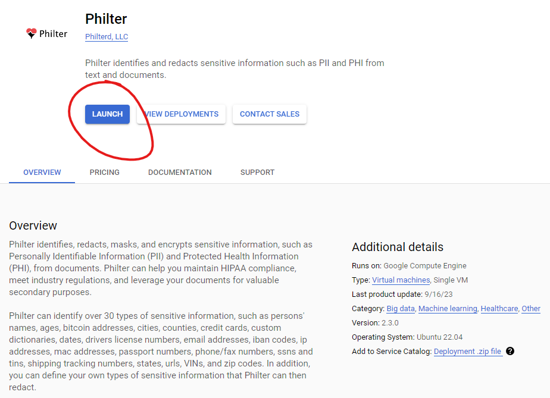

# Philter Quick Start on Google Cloud

Philter on Google Cloud is a virtual machine-based product. A free trial period is available during which there is no charge for the Philter software but there may be charges for the underlying Google Cloud infrastructure.

> Cloud virtual machines launched from a cloud marketplace may not be immediately suitable for a HIPAA environment. Refer to your compliance officer for your organization's requirements to ensure compliance with all relevant regulations.


## Launch Philter in Google Cloud

1. Go to [Philter in the Google Cloud Marketplace](https://console.cloud.google.com/marketplace/product/philterd-public/philter).
2. Click the **Launch on Compute Engine** button.



**Virtual Machine Recommendations**

The general purpose machine type is n2-standard-2 and this machine type should be adequate for most use-cases. We recommend 8 vCPUs and 8-16 GB of RAM for a production deployment.

> Google Cloud will automatically open ports `22` (SSH) and `8080` (Philter API). These ports are required to be open but you may want to modify the security groups to limit their scope of availability by restricting access to specific CIDR ranges.


Congratulations! You have deployed Philter in Google Cloud. You are now ready to filter text!

## Try it out!

With Philter now running we can take it for a spin. We will send some text to Philter and inspect at the response we get back. The Philter virtual machine running in your cloud account should have a public IP address (unless you customized the deployment). We will use that public IP address to interact with Philter.

Philter, by default, will be configured with an HTTPS listener on port 8080 using a self-signed certificate. It is recommended that prior to use in a production environment the self-signed certificate is replaced by a valid certificate owned by your organization.

In the command below, replace `<PUBLIC_IP>` with the virtual machine’s public IP address or public host name.

```
curl -k -X POST https://<PUBLIC_IP>:8080/api/filter --data "George Washington was a patient and his SSN is 123-45-6789." -H "Content-type: text/plain"
```

With this command we are sending the text in the command to Philter for filtering. Philter will identify the patient name (George Washington) and the SSN (123-45-6789) and redact those values in the response. You can always use curl to send text to Philter as in these examples but there are also [SDKs](../api_and_sdks/sdks.md) you can use, too, to integrate Philter with your applications.

### Redacting Sensitive Information from Text

The types of sensitive information that Philter identifies and removes is controlled by policies. By default, Philter includes a filter profile that includes many of the types of sensitive information, such as names and social security numbers. We can send text to filter to Philter for filtering using this default filter profile with the following command:

```
curl -k -X POST https://localhost:8080/api/filter -d @file.txt -H "Content-Type: text/plain"
```

This command sends the contents of the file `file.txt` to Philter. Philter will apply the enabled filters and return a plain-text response consisting of the filtered text. (Replace localhost with the IP address or host name of Philter if you are not running the command where Philter is running.) You can also send text directly in the request instead of sending it as a file:

```
curl -k -X POST https://localhost:8080/api/filter --data "Your text goes here..." -H "Content-type: text/plain"
```

## Next Steps

Now that you have Philter running and know how to send text to it, you are ready to integrate Philter into your existing workflow and systems. Philter’s API details how to send files to Philter. Clients for some languages for Philter’s API are available on GitHub.

> Be sure to check out [Policies](../policies/filter_policies.md) to see how you can customize the types of sensitive information Philter redacts!
